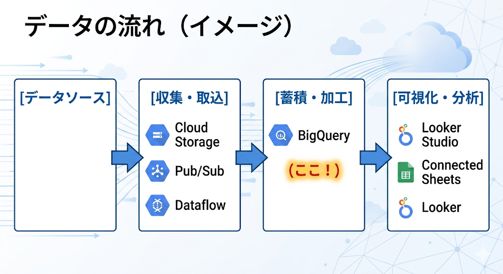

# BigQuery入門 - Google Cloudの大規模データ分析基盤を理解する

この記事では、Google CloudのBigQueryについて「そもそも何ができるのか」「なぜ選ばれるのか」を中心に解説します。BigQueryの導入を検討している方や、データ分析基盤の全体像を掴みたい方に向けた入門記事です。

## BigQueryとは

BigQueryは、**Google Cloudが提供するフルマネージドのデータウェアハウス（DWH）** サービスです。

一言でまとめると：

- **サーバー管理不要**で、**TB〜PBクラスのデータを数秒〜数分で分析**できるクラウドDWH
- **SQLを書くだけ**でデータ分析ができ、インフラの知識がなくても始められる
- **従量課金制**で、使った分だけ料金が発生する

```sql
-- BigQueryでの基本的なクエリ例
-- 一般公開データセットを使って、GitHubのコミット数を集計
SELECT
  author.name,
  COUNT(*) AS commit_count
FROM
  `bigquery-public-data.github_repos.commits`
WHERE
  committer.date > '2024-01-01'
GROUP BY
  author.name
ORDER BY
  commit_count DESC
LIMIT 10;
```

このようなクエリが、**数TBのデータに対しても数秒で結果を返す** のがBigQueryの強みです。

---

## 1. BigQueryの位置づけ

### Google Cloudの中での役割

Google Cloudには多数のサービスがありますが、BigQueryは**データの蓄積・加工・分析**を担当するサービスです。

```text
データの流れ（イメージ）

[データソース] → [収集・取込] → [蓄積・加工] → [可視化・分析]
                  Cloud Storage    BigQuery        Looker Studio
                  Pub/Sub          (ここ!)         Connected Sheets
                  Dataflow                         Looker
```


<!-- キャプチャ: Google Cloudコンソール > BigQueryの概要ページ -->

---

## 2. BigQueryの主な特徴

### 2-1. フルマネージドでサーバーレス

従来のDWHでは、サーバーの構築・チューニング・スケーリングが必要でした。BigQueryでは**これらすべてをGoogleが管理**します。

| 項目         | 従来のDWH    | BigQuery |
| ------------ | ------------ | -------- |
| サーバー構築 | 必要         | 不要     |
| スケーリング | 手動設定     | 自動     |
| チューニング | DBAが実施    | ほぼ不要 |
| メンテナンス | 定期的に必要 | 不要     |

### 2-2. 圧倒的な処理速度

BigQueryはGoogleの内部技術（Dremel、Colossus）を基盤としており、**カラムナストレージ**と**大規模並列処理**により、TB規模のデータでも高速に処理できます。

```sql
-- 例：約6.5TBのデータに対するクエリも数分で完了
SELECT
  FORMAT_DATE('%Y-%m', created_at) AS month,
  COUNT(*) AS total_events
FROM
  `bigquery-public-data.github_repos.events`
GROUP BY
  month
ORDER BY
  month DESC;
```


<!-- キャプチャ: BigQueryコンソールでクエリ実行後の結果画面。処理バイト数と実行時間が表示される -->

### 2-3. 従量課金でコストを最適化

BigQueryの料金体系はシンプルです：

| 料金種別                   | 内容                     | 目安                          |
| -------------------------- | ------------------------ | ----------------------------- |
| **ストレージ**             | 保存データ量に応じた課金 | アクティブ: $0.02/GB/月       |
| **クエリ（オンデマンド）** | 処理データ量に応じた課金 | $5/TB                         |
| **無料枠**                 | 毎月の無料利用分         | ストレージ10GB + クエリ1TB/月 |

**毎月1TBまでのクエリが無料**なので、個人の学習や小規模な分析であれば、ほぼ無料で利用できます。

### 2-4. 標準SQLをそのまま使える

BigQueryは**標準SQL（Standard SQL）** に対応しているため、既存のSQLの知識がそのまま活かせます。

```sql
-- ウィンドウ関数も使える
SELECT
  department,
  employee_name,
  salary,
  RANK() OVER (PARTITION BY department ORDER BY salary DESC) AS rank
FROM
  `project.dataset.employees`;

-- WITH句（CTE）も使える
WITH monthly_sales AS (
  SELECT
    FORMAT_DATE('%Y-%m', sale_date) AS month,
    SUM(amount) AS total
  FROM
    `project.dataset.sales`
  GROUP BY
    month
)
SELECT * FROM monthly_sales WHERE total > 1000000;
```

### 2-5. Googleサービスとの連携が容易

BigQueryは以下のGoogleサービスと簡単に連携できます：

- **Google スプレッドシート**: スプレッドシートのデータを直接クエリ可能
- **Google アナリティクス（GA4）**: アクセスログを自動エクスポート
- **Looker Studio**: クエリ結果をダッシュボードで可視化
- **Cloud Storage**: CSV/JSON/Parquetなどのファイルを直接読み込み

---

## 3. BigQueryを始めてみよう

### 3-1. Google Cloudアカウントの作成

1. [Google Cloud Console](https://console.cloud.google.com/) にアクセス
2. Googleアカウントでログイン
3. 無料トライアル（$300分のクレジット + 90日間）を有効化


<!-- キャプチャ: Google Cloudの無料トライアル登録ページ -->

### 3-2. BigQueryコンソールを開く

1. Google Cloud Consoleの左側メニューから「BigQuery」を選択
2. またはURLで直接アクセス: `console.cloud.google.com/bigquery`


<!-- キャプチャ: BigQueryコンソールの初期画面。ナビゲーションペイン、クエリエディタ、詳細ペインの3つのセクション -->

BigQueryのコンソールは主に3つのエリアで構成されています：

| エリア                         | 役割                                           |
| ------------------------------ | ---------------------------------------------- |
| **ナビゲーションペイン**（左） | プロジェクト・データセット・テーブルの一覧表示 |
| **クエリエディタ**（中央上）   | SQLを記述・実行する場所                        |
| **結果パネル**（中央下）       | クエリの実行結果やテーブルの詳細を表示         |

### 3-3. 公開データセットで試してみる

BigQueryには、すぐに試せる**一般公開データセット**が用意されています。アカウント作成直後から利用可能です。

```sql
-- 一般公開データセットの例：アメリカの赤ちゃんの名前
-- データセットを追加せずに、そのまま実行できます
SELECT
  name,
  gender,
  SUM(number) AS total
FROM
  `bigquery-public-data.usa_names.usa_1910_current`
WHERE
  year >= 2000
GROUP BY
  name, gender
ORDER BY
  total DESC
LIMIT 10;
```


<!-- キャプチャ: 上記クエリの実行結果画面 -->

### 3-4. bqコマンドラインツール

Webコンソール以外に、ターミナルからも操作可能です。

```bash
# Google Cloud SDKをインストール後、以下のコマンドで利用可能

# クエリの実行
bq query --use_legacy_sql=false \
  'SELECT name, SUM(number) as total
   FROM `bigquery-public-data.usa_names.usa_1910_current`
   GROUP BY name
   ORDER BY total DESC
   LIMIT 5'

# データセットの一覧表示
bq ls

# テーブルのスキーマ確認
bq show bigquery-public-data:usa_names.usa_1910_current
```

---

## 4. 他のDWHサービスとの比較

BigQueryの導入を検討する際、以下のサービスと比較されることが多いです。

| 観点         | BigQuery                  | Amazon Redshift      | Azure Synapse        |
| ------------ | ------------------------- | -------------------- | -------------------- |
| 課金方式     | クエリ処理量 + ストレージ | ノード数（時間課金） | 処理量 or 専用プール |
| スケーリング | 自動                      | 手動リサイズ         | 自動/手動            |
| 初期コスト   | 無料枠あり                | 2ヶ月無料トライアル  | 無料枠あり           |
| 強み         | Google連携、手軽さ        | AWS連携、安定性      | Microsoft連携        |

**選定のポイント**: 既にGoogleサービス（GA4、スプレッドシート等）を多く使っている場合は、BigQueryとの連携がスムーズなためおすすめです。

---

## 5. ハマりポイント・注意点

### コスト面での注意

- **`SELECT *` は避ける**: 全カラムをスキャンすると処理データ量が増え、コストが上がります。必要なカラムだけ指定しましょう。

```sql
-- NG: 全カラムスキャン（コスト大）
SELECT * FROM `project.dataset.large_table`;

-- OK: 必要なカラムだけ指定（コスト小）
SELECT id, name, created_at FROM `project.dataset.large_table`;
```

- **パーティションテーブルを活用**: 日付でパーティション分割すると、スキャン範囲が限定されコストを削減できます。

```sql
-- パーティションフィルタでスキャン範囲を限定
SELECT *
FROM `project.dataset.partitioned_table`
WHERE date_column BETWEEN '2024-01-01' AND '2024-01-31';
```

### クエリ実行前のデータ量確認

BigQueryコンソールでは、クエリ実行前に右上に**推定処理データ量**が表示されます。実行前に必ず確認する習慣をつけましょう。


<!-- キャプチャ: クエリエディタ右上の「このクエリを実行すると、○○ が処理されます。」の表示 -->

---

## まとめ

| ポイント     | 内容                                                  |
| ------------ | ----------------------------------------------------- |
| BigQueryとは | Google CloudのフルマネージドDWH                       |
| 強み         | 高速処理、サーバーレス、従量課金                      |
| 始め方       | Google Cloud無料トライアル → 公開データセットで即実践 |
| コスト最適化 | `SELECT *`を避け、パーティションを活用                |

BigQueryは**「とりあえず触ってみる」ハードルが非常に低い**サービスです。無料枠の範囲内で公開データセットを使った分析を試してみることをおすすめします。

### 次のステップ

今後、以下のような実践的な記事も追加予定です：

- BigQueryのコスト最適化テクニック
- パーティションとクラスタリングの使い分け
- BigQuery MLで機械学習を始める
- Dataformを使ったデータパイプライン構築

---

*最終更新: 2026-03-25*
